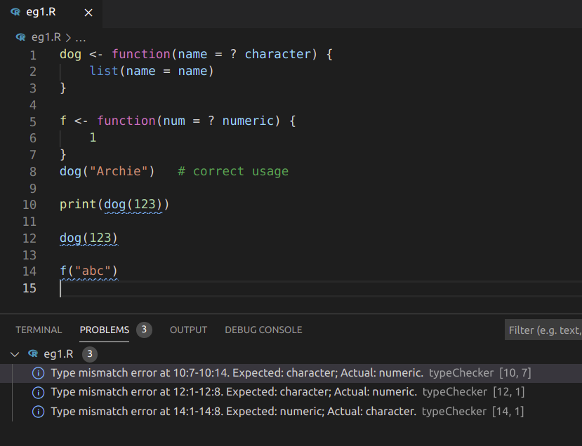

Static type checking in R
================

## R package `typeChecker`

Implements, as an experiment, a primitive static type checker following
the type annotation syntax proposed in [DSC 2017 Syntax Extensions to
R](https://www.r-project.org/dsc/2017/slides/syntax-extensions.html#/type-annotations)
and the [types](https://github.com/jimhester/types) package.

## Installation and Usage

``` r
# install.packages("remotes")
remotes::install_github("kcf-jackson/typeChecker")
```

Perform type checking on a file with `type_check(filepath)`, or on the
active file in RStudio using `type_check_active()`.

## Examples

#### Example 1

``` r
dog <- function(name = ? character) {
    list(name = name)
}

dog("Archie")   # correct usage
dog(123)        # type error
# In the expression:
# dog(123)
# The following type error is found:
# Type mismatch. Inferred: numeric; Annotated: character
```

#### Example 2

``` r
dog <- function(name = ? character) {
    list(name = name) ? dog
}
introduce <- function(x = ? dog) {
    sprintf("Woof! My name is %s!", x$name)
}

x <- dog("Napawleon")
introduce(x)             # correct usage
introduce("Pawgustus")   # type error
# In the expression:
# introduce("Pawgustus")
# The following type error is found:
# Type mismatch. Inferred: character; Annotated: dog
```

## How the package works

The package type-checks R files by looking for contradiction between the
annotated types and the inferred types. If no contradiction is found,
then the file is type-checked. Otherwise, it will report the expression
in which the error is found.

### Notes

-   Type-checking in the contexts of dynamic types and static types are
    different.
-   When there is no annotation, there cannot be any contradiction.
-   An annotation is a tag, and it can be named arbitrarily.
-   Constants are assigned their natural types, e.g. numeric for `10`,
    character for `'a'`, and logical for `TRUE`.
-   All other (un-annotated) variables are assumed the ANY type, which
    is compatible with any type.
-   Currently, the package does not support function type. In a
    static-type language, the type signature of a function can be
    identified by the types of the input and the output. In our case,
    the function is assigned the function type as the input and output
    types can vary. The important consequence is that a function that is
    defined but not used anywhere will not cause an error even when some
    expressions in the function body do not type-check.

## Integration with editors

### Visual Studio Code (VS Code)

The integration with VS Code is kindly provided by
[@andycraig](https://github.com/andycraig). The feature supports exact
tracking of the line and column numbers at which the type error occurs.
Here is a screenshot:



To enable this feature, install the [R LSP Client
extension](https://marketplace.visualstudio.com/items?itemName=REditorSupport.r-lsp)
in VS Code and the R package `languageserver` as follows:

    remotes::install_github("andycraig/languageserver@types")

The type-checking will then trigger automatically on R files.
